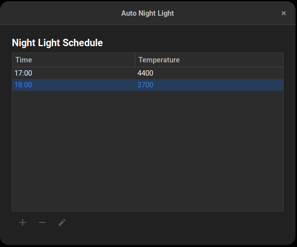
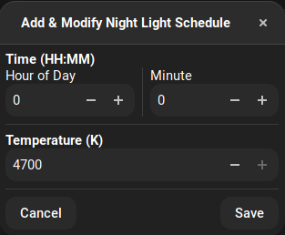

# Gnome Auto Night Light Extension

Automatically adjust GNOME's in-build night light temperature from a schedule!

## How To Use?

https://extensions.gnome.org/extension/4482/auto-night-light/  

1. Open the GNOME extension manager 
2. Turn on Auto Night Light 
3. Click the gear icon to open up the night light schedule preferences 
4. Click the + icon to add a schedule 
5. Configure your schedule and hit save 
6. To remove a schedule, select a schedule and click the - icon 
7. To edit a schedule, select a schedule and click the edit icon 

NOTE: Make sure you have GNOME's night light enabled! And set to custom schedule midnight-midnight (so that night light is always active)

## How To Debug?
  
journalctl -f -o cat | grep "Auto Night Light"

